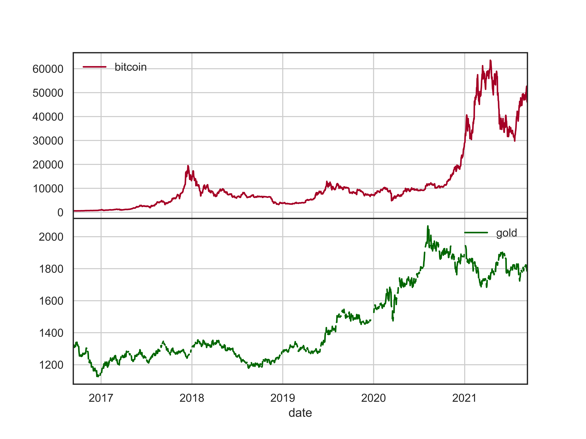

# Trading-Strategy
#### **MCM/ICM2022: Trading strategy design for bitcoin and gold**  
- Used traditional technical analysis, GFTD timing signal and rotation strategy to design basic trading strategies;  
- Proposed dynamic fusion method from portfolio management science to optimize the weight allocation;  
- Performed sensitivity analysis towards transaction costs;  
- **Check the "final_report" for details.**

Results verview:
- Bitcoin and gold:

- Rotation strategy:

- GFTD signal:

    

- Cumulative return of investors with different levels of risk preferences:

- Commission fee ratio and transaction frequency

