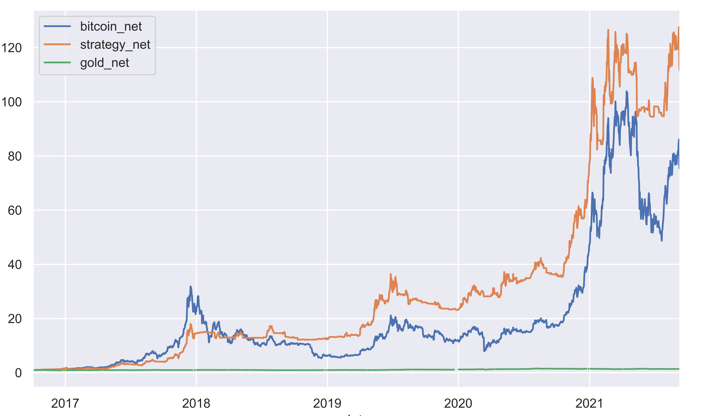
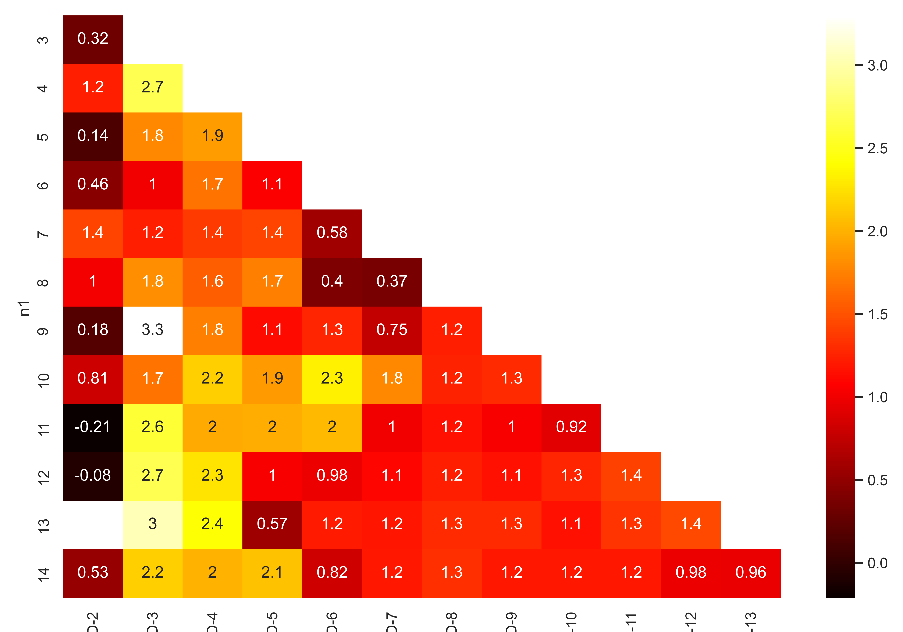
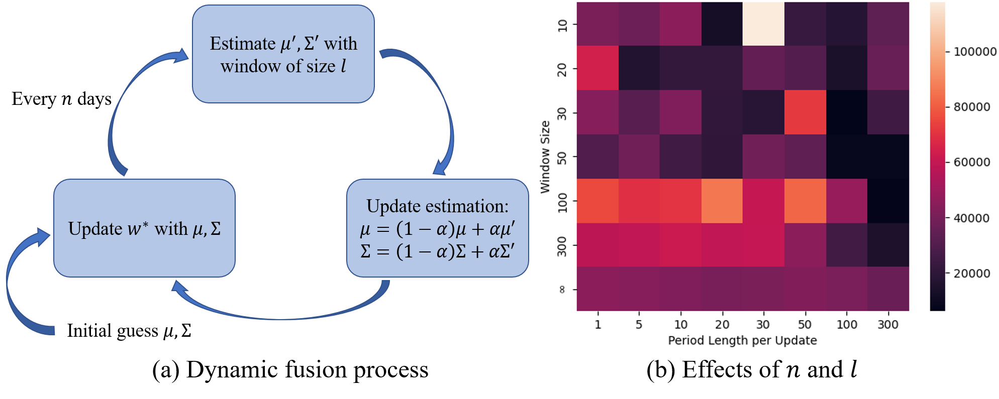
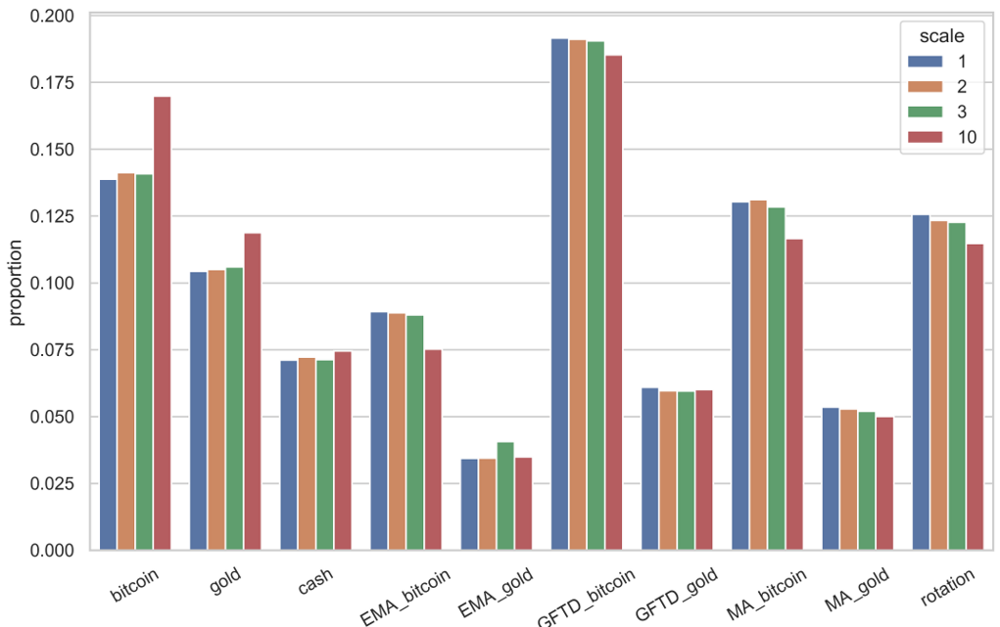
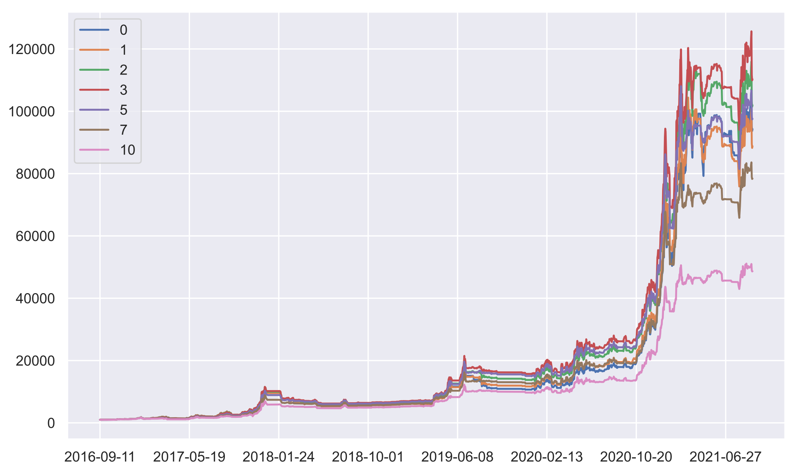
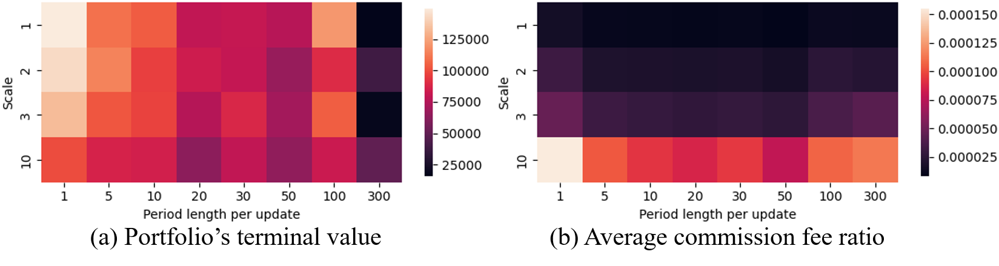
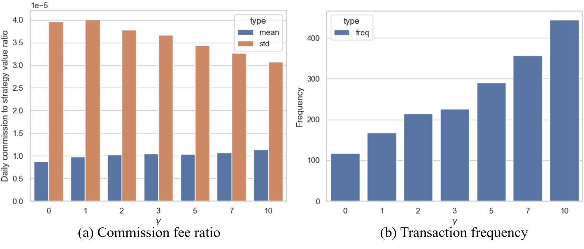

# Trading-Strategy
### **MCM/ICM2022: Trading strategy design for bitcoin and gold**  
- Used traditional technical analysis, GFTD timing signal and rotation strategy to design basic trading strategies;  
- Proposed dynamic fusion method from portfolio management science to optimize the weight allocation;  
- Performed sensitivity analysis towards transaction costs;  
- Check the "final_report" for details.

### **Results Overview**
- Rotation strategy:

  

- GFTD signal hyperparameter grid search (bitcoin only) with RoMaD metric:

  

- Dynamic strategy fusion pipline:

  

- Proportion of individual strategy in the fused version:

  

- Cumulative return of investors with different levels of risk preferences:

  

- Effect of commission fee with portfolio terminal value

  

- Commission fee ratio and transaction frequency

  

